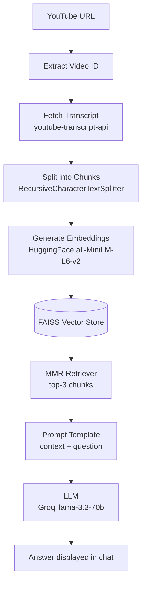

# 🎥 YouTube RAG Assistant

A Retrieval-Augmented Generation (RAG) chatbot that lets you have a conversation with any YouTube video. Paste a video URL, and the app fetches its transcript, indexes it, and answers your questions using only the content spoken in the video.

---

## ✨ Features

| 📝 **Transcript Extraction** | 🧩 **Smart Chunking** |
|---|---|
| Automatically fetches English captions from any YouTube video using its video ID. | Splits long transcripts into overlapping chunks so context isn't lost at boundaries. |

| 🔍 **Semantic Retrieval** | 💬 **Grounded Q&A Chat** |
|---|---|
| Uses vector embeddings + MMR search to find the most relevant *and* diverse transcript chunks. | Answers are generated strictly from retrieved context — not the model's general knowledge. |

| ⚡ **Cached Processing** | 🖥️ **Simple Chat UI** |
|---|---|
| Videos are indexed once and cached, so re-asking questions doesn't re-process the transcript. | Persistent, familiar chat interface built entirely with Streamlit. |

---

## 🏗️ System Architecture



---

## 🧠 How It Works

---

### 🔗 Step 1 — URL Parsing
The video ID is extracted from either a standard (`youtube.com/watch?v=`) or shortened (`youtu.be/`) YouTube URL.

---

### 📝 Step 2 — Transcript Fetching
The transcript is retrieved via the YouTube Transcript API and joined into a single block of raw text. If a video has no captions, this fails gracefully with a clear error message.

---

### 🧩 Step 3 — Chunking
The transcript is split into ~1000-character chunks with 200-character overlap:
```
RecursiveCharacterTextSplitter(chunk_size=1000, chunk_overlap=200)
```
The overlap ensures a sentence or idea split across two chunks doesn't lose context.

---

### 🔢 Step 4 — Embedding & Indexing
Each chunk is converted into a vector using HuggingFace's `all-MiniLM-L6-v2` model, and all vectors are stored in a **FAISS** index for fast similarity search.

---

### 🎯 Step 5 — Retrieval
When a question is asked, the retriever fetches the **top 3** most relevant chunks using **MMR (Maximal Marginal Relevance)** — this balances relevance with diversity, avoiding 3 near-duplicate chunks that say the same thing.

---

### 🤖 Step 6 — Answer Generation
The retrieved chunks are inserted into a prompt template alongside the user's question, and passed to Groq's `llama-3.3-70b-versatile` model. The prompt explicitly instructs the model to answer **only** from the given context.

---

### 💬 Step 7 — Chat Interface
Questions and answers are rendered in a chat-style UI using Streamlit's native `st.chat_message`, with history persisted for the session via `st.session_state`.

---

## 🛠️ Tech Stack

| Component | Technology |
|---|---|
| Web Framework | [Streamlit](https://streamlit.io/) |
| Orchestration | [LangChain](https://www.langchain.com/) (LCEL — `RunnableParallel`, `RunnableLambda`) |
| LLM | [Groq](https://groq.com/) — `llama-3.3-70b-versatile` via `langchain-groq` |
| Embeddings | HuggingFace `all-MiniLM-L6-v2` via `langchain-huggingface` |
| Vector Store | [FAISS](https://github.com/facebookresearch/faiss) |
| Transcript Source | [`youtube-transcript-api`](https://pypi.org/project/youtube-transcript-api/) |

---

## 📂 Project Structure

```
youtube-rag-assistant/
├── app.py              # Main application — UI, RAG pipeline, chat logic
├── .env                # Environment variables (API keys) — not committed
├── requirements.txt    # Python dependencies
└── README.md           # Project documentation
```

---

## ⚙️ Setup & Installation

### 1️⃣ Clone the repository
```bash
git clone <your-repo-url>
cd <your-repo-folder>
```

### 2️⃣ Create a virtual environment
```bash
python -m venv venv
source venv/bin/activate      # On Windows: venv\Scripts\activate
```

### 3️⃣ Install dependencies
```bash
pip install streamlit langchain langchain-groq langchain-community langchain-huggingface langchain-text-splitters youtube-transcript-api faiss-cpu python-dotenv
```

### 4️⃣ Configure environment variables
Create a `.env` file in the project root:
```
GROQ_API_KEY=your_groq_api_key_here
```
> Get a free key at [console.groq.com](https://console.groq.com/).

### 5️⃣ Run the app
```bash
streamlit run app.py
```
The app opens automatically at `http://localhost:8501`.

---

## 🚀 Usage

1. Paste a YouTube video URL into the sidebar.
2. Click **Process Video** — the transcript is fetched, chunked, and indexed (cached for reuse).
3. Ask questions in the chat box once processing succeeds.
4. Get answers grounded in what was actually said in the video.

---

## ⚠️ Limitations

- Only supports videos with **English captions**.
- No transcript = no answer (auto-generated or manual captions required).
- Answer quality depends on caption accuracy.
- Chat history and indexed videos are session-based — nothing persists across app restarts.

---

## 🔮 Roadmap

- [ ] Source citations with transcript timestamps for every answer
- [ ] Multi-turn conversational memory (follow-up question handling)
- [ ] Video metadata display (title + thumbnail)
- [ ] Auto-generated video summary
- [ ] Multi-language transcript support

---

